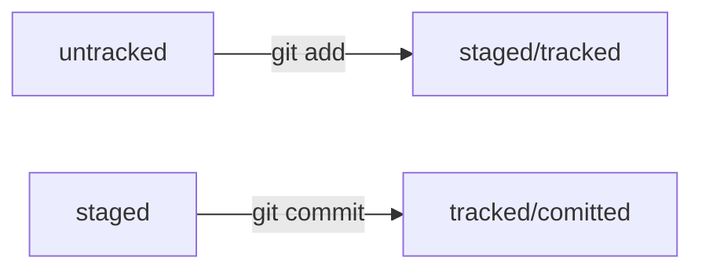

# WELCOME TO THE INTRODUCTION OF THE GIT
To create a repository you need to write this in git bash
```bash
git init
```
That allows you to create a new directory which is actually your git repository

## Creating new files
To create a new file use:
```bash
touch <nameofFile>.type
```
But before make sure that you're at the directory you want to create a file to

## Initialization
Use this commands to add and commit your files
```bash
git add --all
git commit -m "My first commit"
```
That allows you to eventually commit changes

### SSH-key
To have an access to your remote repository you need to:
1. Create a SSH-key
2. Tie your key with the remote repository
---
```bash
ssh-keygen -t ed25519 -C "your email that's connected to GitHub"
clip < ~/.ssh/id_ed25519.pub
```
And now just paste it to GitHub to work without obstacles

### Connecting local repository with remote repository
To connect you gotta:
```bash
git remote add origin git@github.com:%name-of-your-account%/your-project.git
```
After commits just push all the changes to the remote repository
```bash
git push -u origin main
```
Just make sure you print -u for the first time, you don't need to print it all the time. Next time write just "git push"
---
### Hash
Hash is an identifier of a commit, fingerprint
Hash of the last commit is located in HEAD, you can use the word "HEAD" to access the last commit like this:
```bash
commit 150df1f4b40ec73033dfe58f5e612893da372379 (HEAD -> main, origin/main)
Author: Daniil Moskalenko <justcr1si@yandex.ru>
Date:   Sun May 5 10:33:42 2024 +0300

    Some changes in writing
```
You can see HEAD -> main (the name of a branch)
### Log
Log provides information about all commits you've made with information about hash, author, date and a comment. To have an access to look at the history of commits print this command in git bash
```bash
git log
```
The information is gonna be like this
```bash
commit 150df1f4b40ec73033dfe58f5e612893da372379 (HEAD -> main, origin/main)
Author: Daniil Moskalenko <justcr1si@yandex.ru>
Date:   Sun May 5 10:33:42 2024 +0300

    Some changes in writing

commit c87e7f4419c54b4c94d2a70cf0cf8aca989f26d9
Author: Daniil Moskalenko <justcr1si@yandex.ru>
Date:   Thu May 2 13:14:40 2024 +0300

    New information in README file

commit f8b5aa76be8b0e0c5f86a7038f0a26fbd4e95f7b
Author: Daniil Moskalenko <justcr1si@yandex.ru>
Date:   Thu May 2 12:56:40 2024 +0300

    README file
```
### Files status

These are four file statuses
Git doesn't see changes in untracked files
Git adds tracked status to a file which was added to the staging area or was commited

If a file is in the staging area and you change this file, the previous
version of the file will be still in the staging area, but the file will
be modified and if you want to add a new version of the file to the
staging area you need to print "git add" again
### Messages for commits
The message must follow certain rules
Message length should be from 30 to 72 symbols
There are some rules a message must follow:
1. Corporative (example: LGS(logistics)-239: add a list with new numbers/добавить лист с новыми числами)
2. Conventional Commits (example: feat: add a counter of the sum of orders/or fix instead of feat) [READMORE](https://www.conventionalcommits.org/ru/v1.0.0-beta.4/#спецификация "Conventional documentation")
3. GitHub-style (example: fix #334, add a traffic of temperature/добавить трафик температуры)
---
For messages in English you need to use imperative messages like add, use, fix

For messages in Russian you need to use infinitives like добавить, исправить and so on <br>

These recommendations have developed historically, and many projects follow them
### README File
Read a little bit about README file to know how to write about your projects to other people
[README](https://practicum.yandex.ru/trainer/git-basics/lesson/c6b9607c-e8bc-4446-89f9-c74522c3492f/ "Yandex Practicum documentation") or just use [README-2](https://gist.github.com/fomvasss/8dd8cd7f88c67a4e3727f9d39224a84c "GitHub documentation")